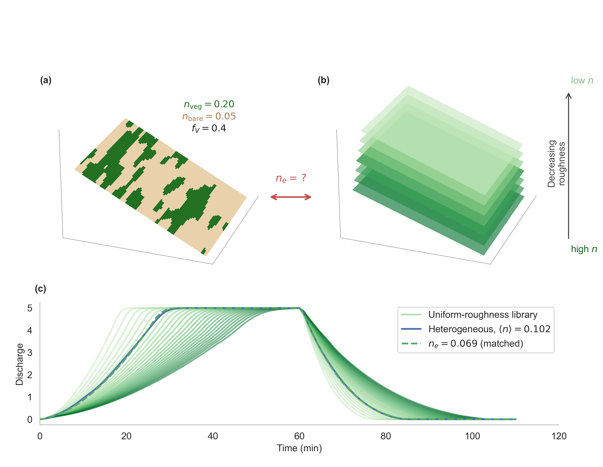
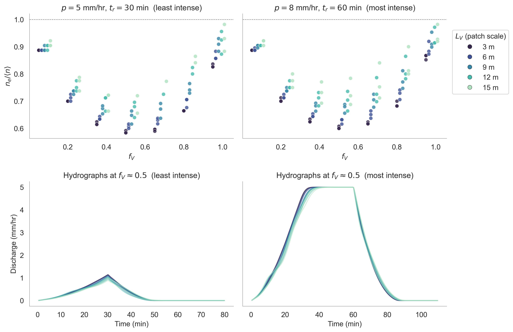

# Equivalent Roughness for Overland Flow on Heterogeneous Hillslopes

This repository contains the simulation ensemble, analysis code, and manuscript
materials for the study of how spatial heterogeneity in surface roughness — due
to patchy vegetation — shapes the **equivalent (calibration) Manning's $n$** at
the hillslope scale.

---

## Background

Upscaling overland flow from patch to hillslope scales requires a roughness
parameter that captures the aggregate effect of a spatially variable surface.
Rather than the spatial mean $\langle n \rangle$, a model calibrated against a
heterogeneous hillslope recovers an **equivalent roughness** $n_e$ that reflects
how flow routes around or through rough patches.

<p align="center">
  
</p>

*Figure 1 — The equivalent-roughness problem: (a) a patchy hillslope surface, (b) its uniform-roughness counterpart, and (c) the matched outlet hydrograph posing the question $n_e = ?$*

The central quantity studied here is the **effective roughness ratio**

$$r_\mathrm{eq} = \frac{n_e}{\langle n \rangle},$$

and how it depends on vegetation cover ($f_V$), spatial pattern (patch length
scale $\ell$, anisotropy, connectivity), and storm characteristics (rainfall
rate $p$, duration $t_r$).

<p align="center">
  
</p>

*Figure 2 — Main result: $n_e/\langle n \rangle$ vs $f_V$ for the least and most intense storms (top), with corresponding hydrographs at $f_V \approx 0.5$ (bottom), coloured by patch lengthscale $L_V$. The ratio is always below unity, is minimised near $f_V = 0.5$, and increases with patch size.*

Two definitions of $n_e$ are compared:

| Symbol | Definition |
|---|---|
| $n_e^\mathrm{IF}$ | Minimises error in event-integrated **infiltration fraction** |
| $n_e^\mathrm{Q}$ | Minimises RMSE of the **outlet hydrograph** $q(t)$ |

The simulations use the 1-D Saint-Venant / shallow-water equations (SWOF) with
Manning friction on a binary roughness field: bare soil ($n_b$) and vegetated
patches ($n_v$).

---

## Repository layout

```
roughness-scale/
├── README.md                       ← this file
├── overleaf/                       ← git clone of the Overleaf manuscript
│   ├── main.tex
│   ├── equiv_rough.tex, spatial_averaging.tex, lit review.tex
│   ├── references.bib
│   └── figures/
├── swof_code/                      ← Python modules for SWOF simulation I/O
│   ├── source_functions_1p3.py     ← core simulation helpers
│   ├── plot_SWOF.py                ← legacy plotting helpers + `names` dict
│   ├── read_SWOF.py, write_SWOF.py ← simulation file I/O
│   ├── topo.py, plot_config.py
│   └── call_runaround*.py          ← batch-run scripts
├── src/                            ← shared Python modules for analysis
│   ├── labels.py                   ← LaTeX labels, colourmaps, font sizes
│   ├── figure_registry.py          ← figure registry read/write helpers
│   └── stats.py                    ← RMSE, R², OLS, residual-correlation helpers
├── notebooks/
│   ├── 1. roughness_scale-compute.ipynb        ← compute derived columns, write summary
│   ├── 2. roughness_scale-pattern.ipynb        ← spatial pattern & storm characteristics
│   ├── 3. roughness_scale-decomp.ipynb         ← variance decomposition & sensitivity
│   ├── 4. roughness_scale-cf-channel_eqs.ipynb ← correction factor & composite-channel eqs
│   ├── 5. roughness_scale-predict.ipynb        ← predicting the effect ratio
│   └── archive/                                ← dated legacy notebooks
├── figures/
│   └── runaround_smooth/
│       ├── fig*.png                ← publication figures
│       ├── figure_registry.txt     ← full figure registry (auto-generated)
│       ├── figure_registry_concise.txt
│       └── scratch/                ← exploratory figures (not registered)
├── latex/
│   ├── build_figure_doc.py         ← compile figure registry → PDF
│   ├── watch_registry.sh           ← auto-rebuild on registry changes
│   └── runaround_smooth_figures.tex
└── scripts/
    └── split_notebook.py           ← split analysis.ipynb → pattern + decomp
```

---

## Notebooks

### `1. roughness_scale-compute.ipynb`
Load raw SWOF simulation output, compute `effect_ratio` ($n_e/\langle n \rangle$)
and related derived columns, and write `summary_slim.pkl`. Run this first.
Produces figure 1 (conceptual sketch).

### `2. roughness_scale-pattern.ipynb`
Scatter and grid plots showing how vegetation pattern statistics ($\sigma$, $f_V$,
anisotropy) and storm characteristics ($p$, $t_r$) drive the effective roughness
ratio. Produces figures 2–3.

### `3. roughness_scale-decomp.ipynb`
T0/T1/T2 variance decomposition of $r_\mathrm{eq}$, hybrid predictions, and
decomposition-term sensitivity analyses. Produces figure 4.

### `4. roughness_scale-cf-channel_eqs.ipynb`
Correction factor and composite-channel equivalent-roughness formulas (Lotter,
Cox, Horton–Einstein, Felkel) compared against the simulation truth. Produces
figures 5–6 and supplementary figures.

### `5. roughness_scale-predict.ipynb`
Predicting $r_\mathrm{eq}$: OLS on variance components, feature selection,
$\langle S_f \rangle$ power-law fit, and tracer-flow visual diagnostics.

---

## Simulation ensemble

The primary batch is **`runaround_smooth`**, located at
`~/Tests/runaround_smooth` (path set via `out_dir` in the notebook setup cell).
Each simulation varies:

| Parameter | Description |
|---|---|
| $f_V$ | Vegetated cover fraction |
| $\sigma$ | Spatial standard deviation of the roughness field |
| $\ell$ | Patch length scale |
| aniso | Patch anisotropy (elongation along / across flow) |
| $p$ | Rainfall rate (mm/hr) |
| $t_r$ | Storm duration (min) |
| $S_0$ | Bed slope |

---

## Setup

**Python environment:** `/opt/homebrew/bin/python3` (base conda). No virtual
environment required. Dependencies: `numpy`, `pandas`, `matplotlib`, `seaborn`,
`scipy`, `statsmodels`, `scikit-learn`.

**Run order:**
1. `1. roughness_scale-compute.ipynb` — generates `summary_slim.pkl`, figure 1
2. `2. roughness_scale-pattern.ipynb` — figures 2–3
3. `3. roughness_scale-decomp.ipynb` — figure 4
4. `4. roughness_scale-cf-channel_eqs.ipynb` — figures 5–6, SI
5. `5. roughness_scale-predict.ipynb` — prediction diagnostics

---

## Reference

> Crompton, O. (in prep.) *Equivalent Roughness for Overland Flow on
> Heterogeneous Hillslopes.*
